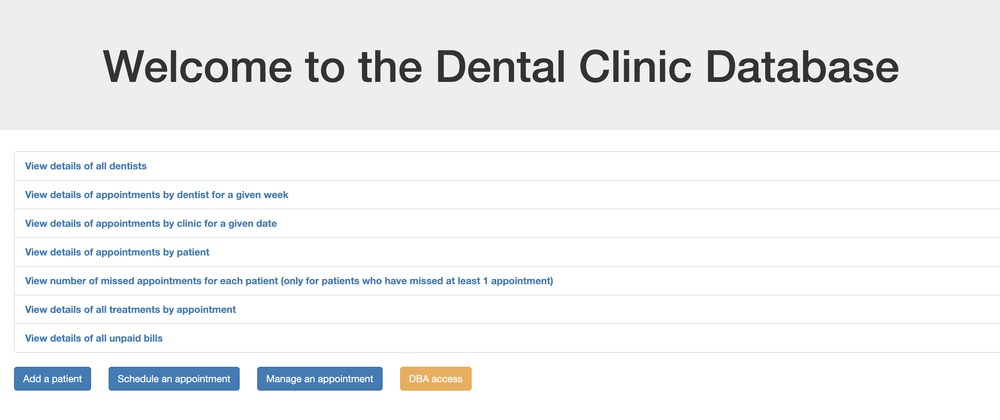

# COMP 353 - Dental Clinic Database

Dental Clinic Database is an interface that manages a network of clinics.

## Getting started

Install the latest version of [MAMP](https://www.mamp.info/en/mamp/mac/) which will set up a local web server with Apache, PHP 7.4.2 and MySQL 5.7.26 installed.

Open the MAMP **Preferences** and navigate to the **Web Server** tab. Select the document root to be the root folder of the project. Select **Start Servers** and in your web browser, enter *localhost:8888*.

## Demo

